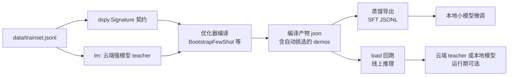

# dspy-query-rewrite

DSPy 优化器 + 模型蒸馏实战项目。以电商搜索最常见的「query 改写 + 意图分类」为例，演示 DSPy 编译器工作流：声明契约、写评分函数、优化器自动编译 prompt、产物落盘、蒸馏导出 SFT 数据。

配套公众号文章《一个被低估的工具：DSPy，把写 Prompt 变成编译》。

## 特性

- **零成本可跑**：默认 DummyLM，不调用任何真实 LLM API，一条命令演示完整链路
- **产物与运行分离**：编译产物是纯 JSON，load 后当普通 Predict 用，线上零优化开销
- **蒸馏导出**：编译产物 demos 自动转成 messages 格式 SFT JSONL，可直接喂本地模型微调
- **换优化器只改配置**：BootstrapFewShot / GEPA / MIPROv2 / SIMBA 一行配置切换
- **工程化结构**：配置 / 数据 / 编译 / 蒸馏 / 推理 / 评测分层，CLI 子命令驱动

## 工作流



编译期用云端强模型当 teacher（高质量 few-shot），运行期产物可配任何 LM，本地 14B 量化也能直接跑。

## 快速开始

```bash
# 1. 安装（Python 3.10+）
pip install -e .

# 2. 零成本演示：编译 -> 蒸馏 -> 推理（DummyLM，不花一分钱）
python -m dspy_query_rewrite demo

# 3. 看产物结构与蒸馏数据
cat artifacts/query_rewrite.json | head
cat artifacts/finetune_data.jsonl
```

demo 输出四步：编译（自动挑 few-shot）→ 产物结构 → 蒸馏导出 → load 回跑推理。

## CLI 子命令

| 命令 | 作用 | 典型用法 |
|---|---|---|
| `demo` | 一条龙演示（默认零成本） | `python -m dspy_query_rewrite demo` |
| `compile` | 编译并保存产物 | `python -m dspy_query_rewrite compile` |
| `distill` | demos 蒸馏导出 SFT JSONL | `python -m dspy_query_rewrite distill` |
| `batch` | 无标注 query 批量打标（规模化蒸馏） | `python -m dspy_query_rewrite batch --queries data/unlabeled.jsonl` |
| `infer` | 单条 query 推理 | `python -m dspy_query_rewrite infer --query "想买个降噪好点的耳机"` |
| `eval` | 留出集评测 baseline vs compiled | `python -m dspy_query_rewrite eval` |

## 接入真实模型

改 `config/config.yaml`：

```yaml
lm:
  provider: openai        # dummy | openai
  model: openai/gpt-4o-mini
  api_key_env: OPENAI_API_KEY
```

API Key 一律走环境变量，禁止写入代码或配置文件：

```bash
export OPENAI_API_KEY=sk-xxx
python -m dspy_query_rewrite compile
```

切回本地模型（Ollama 等）只需改 model 与 provider 约定，prompt 层零改动，模型漂移问题从源头被拆掉。

## 换优化器

`config/config.yaml` 的 `optimizer.name` 一行切换：

| 优化器 | 特点 | 备注 |
|---|---|---|
| BootstrapFewShot | 快速起步，自动挑示例 | dummy 演示默认 |
| GEPA | 遗传算法 + 帕累托，省预算 | 需真实 LM |
| MIPROv2 | 贝叶斯搜指令 + 示例 | 需真实 LM |
| SIMBA | 长尾难例自省 | 需真实 LM |

## 目录结构

```
dspy_query_rewrite/
├── dspy_query_rewrite/       # 主包
│   ├── cli.py                # 命令行入口
│   ├── config.py             # 配置加载
│   ├── data.py               # 数据加载
│   ├── signatures.py         # Signature 契约
│   ├── metrics.py            # 评分函数（metric）
│   ├── lms.py                # LM 工厂（dummy / 真实）
│   ├── optimizers.py         # 优化器工厂 + 编译
│   ├── pipeline.py           # 编译 / 保存 / 加载产物
│   ├── distill.py            # 蒸馏导出 SFT
│   ├── infer.py              # 单条推理
│   └── eval.py               # 留出集评测
├── config/config.yaml        # 统一配置
├── data/                     # trainset / devset / 可放 unlabeled
├── artifacts/                # 编译产物 + 蒸馏数据输出
├── tests/                    # pytest 端到端
└── README.md
```

## 产线提示

- **metric 决定一切**。示例里的判分是简化版。产线请用线上可验证信号（点击、成交、人工抽检）当判分依据，上线前在留出集复测。
- **数据量**。20~50 条标注起步效果更稳，示例给了 10 条便于跑通。
- **编译成本**。优化器会对每条样本发起多次 LLM 调用。云端小模型编译，本地模型推理，两头的好处都拿到。
- **评测口径**。dummy 模式下 eval 仅验证链路可跑，数字无统计意义；真实效果需真实 LM 在留出集上评测。

## License

MIT
